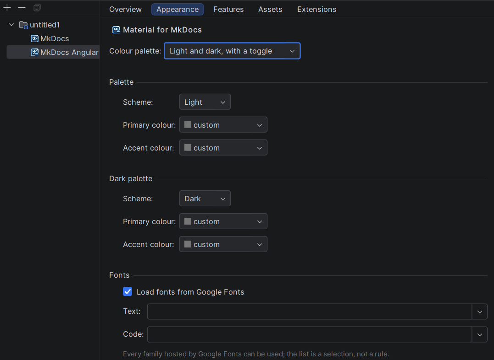
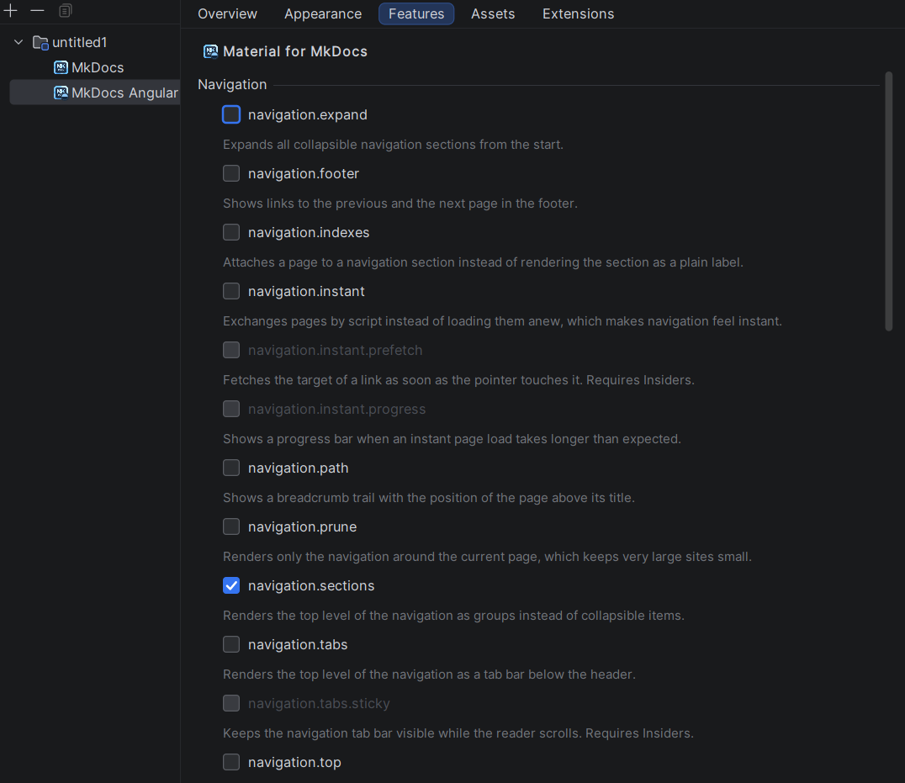
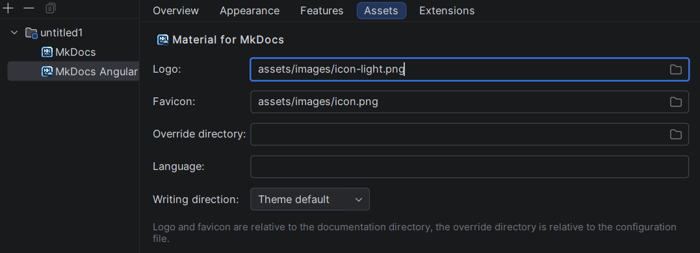
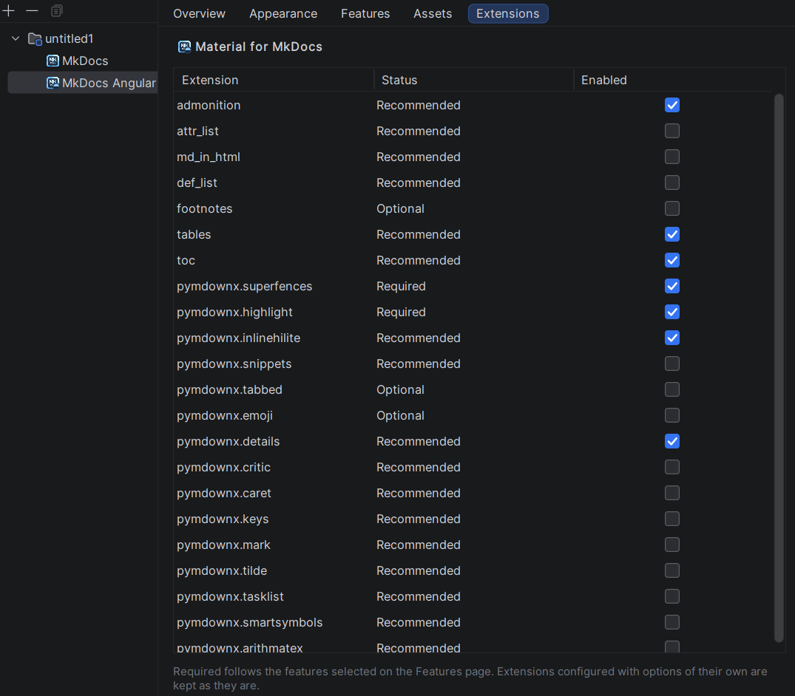

# Angular Material

A site rendered with [Material for MkDocs](https://squidfunk.github.io/mkdocs-material/) carries the
*MkDocs Angular Material* facet, next to the *MkDocs* facet described in the
[Overview](mkdocs-facet.md#the-mkdocs-facet). This page describes what that facet adds to the IDE: the settings
pages it brings to the Project Structure dialog and to the site creation wizard, and the support it adds to
the editor.

!!! note "What a setting means is documented by the theme"

    Nothing on this page explains what `navigation.instant` does to a site or which colour `deep-purple` is.
    That is the theme's own documentation, it is excellent, and it is what the plugin follows:

    * [Setup](https://squidfunk.github.io/mkdocs-material/setup/) — every key of `theme` and `extra`
    * [Changing the colors](https://squidfunk.github.io/mkdocs-material/setup/changing-the-colors/) and
      [Changing the fonts](https://squidfunk.github.io/mkdocs-material/setup/changing-the-fonts/)
    * [Setting up navigation](https://squidfunk.github.io/mkdocs-material/setup/setting-up-navigation/) —
      the `navigation.*` feature flags
    * [Extensions](https://squidfunk.github.io/mkdocs-material/setup/extensions/) — the Markdown extensions
    * [Icons and emojis](https://squidfunk.github.io/mkdocs-material/reference/icons-emojis/)
    * [Customization](https://squidfunk.github.io/mkdocs-material/customization/) — style sheets and
      template overrides

    The descriptions shown in the completion popup, in *Ctrl+Q* and below the feature flags are one-line
    summaries of those pages, not a replacement for them.

## The facet

The facet appears only on a module that holds an MkDocs site, and it is removed together with the *MkDocs*
facet when the site disappears. The dialog lists facets flat rather than as a tree, so the name and the icon
are what tie the two together: the facet is named after MkDocs and sorts directly beside it, and it wears the
MkDocs logo with the Material glyph badged into the corner.

The facet and the configuration file say the same thing, and either one can be the one that changes:

| You change | What happens |
|------------|--------------|
| `theme.name: material` appears in `mkdocs.yml` | the next detection run adds the facet |
| the theme is taken out or switched to another one | the detection removes the facet again |
| the facet is added in *Project Structure* | `theme.name: material` is written into `mkdocs.yml` |
| the facet is removed in *Project Structure* | the whole `theme` key is taken out of `mkdocs.yml` |

Nothing is written when the file already says what the facet says, so a facet the detection itself created
leaves the file untouched.

Both shapes MkDocs accepts are recognised, and the name is compared without regard to case:

```yaml
theme:
  name: material
```

```yaml
theme: material
```

Only the theme name is touched. Settings written next to it survive:

```yaml
theme:
  name: material     # ← replaced
  highlightjs: true  # ← kept
```

A `theme` written as a plain scalar has nowhere to keep the name, so adding the facet turns it into a
mapping. A file without a `theme` at all gets the key appended. Removing the facet removes the `theme` key as
a whole, and MkDocs falls back to its built-in theme.

!!! note

    The facet records what `mkdocs.yml` declares — it does not install the theme. The
    [`mkdocs-material` package](https://squidfunk.github.io/mkdocs-material/getting-started/) still has to be
    available to the MkDocs build itself.

## The settings pages

The settings of the theme are shown by **five tabs** in
*File → Project Structure → Modules → &lt;module&gt; → Facets → MkDocs Angular Material*:

| Tab            | What it holds                                                        |
|----------------|----------------------------------------------------------------------|
| Overview       | what the facet stands for; nothing to edit                           |
| Appearance     | the colour palette and the fonts                                     |
| Features       | `theme.features`, one tick per flag                                  |
| Assets         | logo, favicon, override directory, language, writing direction       |
| Extensions     | the Markdown extensions the theme builds on                          |

### Overview

The first tab shows the theme the facet was detected from and nothing else. There is no field on it, because
there is no decision to make here: the facet mirrors `theme.name` of the configuration file, and adding or
removing the facet is done in the tree on the left of the dialog rather than on the tab.

### Appearance



The shape of the palette is chosen first, because it decides what the rest of the page is worth:

| Colour palette              | What is written to `theme.palette`                     |
|-----------------------------|--------------------------------------------------------|
| Theme default               | nothing — the theme paints in its own colours          |
| One palette                 | a single mapping                                       |
| Light and dark, with a toggle | a sequence of two mappings, each with its `toggle`   |

The second group of controls appears only in the two palette shape; in the other two there is no second
palette to fill in. A palette left at *Theme default* leaves the key out of the file entirely instead of
writing an empty one.

Each palette carries three values:

| Field          | Written to                | Offered                                                              |
|----------------|---------------------------|-----------------------------------------------------------------------|
| Scheme         | `scheme`                  | the two grounds the theme ships, light and dark                       |
| Primary colour | `primary`                 | the primary colours of the theme, each with a swatch of its shade     |
| Accent colour  | `accent`                  | the accent colours, a shorter set — the theme has no accent for the neutral colours |

*Theme default* is offered for both colours and is not a colour at all: it leaves the key out and lets the
theme decide. The swatch is what makes the list readable — `indigo` and `deep-purple` say very little on their
own. Which colour is which is
[shown by the theme](https://squidfunk.github.io/mkdocs-material/setup/changing-the-colors/).

**Fonts** follow the tick that loads them: `theme.font` is written only while *Load fonts from Google Fonts*
is on, and switching it off writes `font: false`, which is how the theme is told to load nothing. Both drop
downs are editable on purpose. The families they offer are a selection, not a rule — the theme loads whatever
family is named from [Google Fonts](https://fonts.google.com/) — so a family typed by hand is kept exactly as
it was typed.

!!! note "A palette these controls cannot represent"

    A site whose `theme.palette` has a shape outside the three above — three entries, a media query of its
    own — switches every palette control off and says so above them. The fonts stay editable. The palette is
    then read-only and is left untouched by *Apply*: writing an approximation back would take a working setup
    apart, and neither half of the file would say which of the two was meant.

### Features



One tick per flag of `theme.features`, grouped by the part of the page the flag changes, each with a line
saying what it does — the long form is under
[Setup](https://squidfunk.github.io/mkdocs-material/setup/). Two rules keep the selection consistent, and both
only ever *prevent* a tick:

| Situation                                              | What the page does                                        |
|--------------------------------------------------------|------------------------------------------------------------|
| A flag contradicts one that is ticked                  | it is disabled, and the tooltip names the blocker          |
| A flag needs another one that is not ticked            | it is disabled, and the tooltip names the prerequisite     |
| A prerequisite is unticked                             | what depends on it is unticked with it                     |
| The file declares two flags that contradict each other | both stay ticked and stay enabled                          |

Nothing is ticked on the user's behalf: a prerequisite is named rather than switched on silently. The reverse
direction is the one place the page acts on its own, because a dependent left ticked and disabled would have
no way back.

A flag that only works with the
[Insiders edition](https://squidfunk.github.io/mkdocs-material/insiders/) of the theme is shown greyed out and
says so in its tooltip. A flag the configuration file declares that this plugin does not know — a newer
version of the theme brings new ones — is not listed here and survives *Apply* untouched.

### Assets



| Field              | Written to          | Relative to                 |
|--------------------|---------------------|------------------------------|
| Logo               | `theme.logo`        | the documentation directory  |
| Favicon            | `theme.favicon`     | the documentation directory  |
| Override directory | `theme.custom_dir`  | the configuration file       |
| Language           | `theme.language`    | —                            |
| Writing direction  | `theme.direction`   | —                            |

The three paths are written relative, and to two different places — that is a rule of MkDocs, not a choice of
this page. The file choosers therefore start in the right directory and turn what was picked back into a
relative path; an absolute one would work on the machine that picked it and nowhere else. A path typed by hand
is left exactly as typed, because a site may well point at something that does not exist yet.

The writing direction offers *Theme default*, `ltr` and `rtl`; *Theme default* leaves the key out. An empty
field is not the same as a missing key, so a field naming nothing removes its key rather than writing an empty
value. Which language codes the theme ships translations for is listed under
[Changing the language](https://squidfunk.github.io/mkdocs-material/setup/changing-the-language/).

The override directory is the same directory the action *Material Template Overrides…* fills — see
[Template overrides](#template-overrides).

### Extensions



Every Markdown extension the theme builds on, with what it is worth to *this* site and whether the site lists
it. Enabling happens in the row itself, through the tick in the last column.

| Status      | Meaning                                                                        |
|-------------|--------------------------------------------------------------------------------|
| Required    | something in the configuration forces it; without it that something does not render |
| Recommended | nothing forces it, but the theme builds on it wherever it is there              |
| Optional    | it merely widens what an author can write                                       |

Nothing is required by the theme as such — it renders a plain site without a single entry under
`markdown_extensions`. An extension becomes *required* only once something asks for it, and here that means a
flag ticked on the Features page: the status column is computed against the current selection of that page, so
ticking `content.code.annotate` turns `pymdownx.superfences` from a recommendation into a requirement while
both pages are open.

An extension the file configures with options of its own — `- toc:` with a `permalink` below it — is kept with
its options: the table only ever sees the identifier. What each extension adds to the Markdown of a site is
documented under [Extensions](https://squidfunk.github.io/mkdocs-material/setup/extensions/).

### In the creation wizard

*New → MkDocs Site* offers **Angular Material** in its feature step. Switching it on writes the theme into the
configuration file of the new site and attaches the facet right away, so the finished site carries it without
waiting for the next detection run.

The four editable pages appear there a second time: they are appended behind the feature step, in the same
order, and unticking the feature takes them out again. They are the same page objects rather than a second
implementation of them — what one place can do, the other can do too, and neither can drift away from the
other. What is filled in there lands in the `theme` block of the file the wizard writes.

### What is written, and when

The configuration file is the single source of truth, and the facet state is not: opening a tab reads
`mkdocs.yml`, and *Apply* is compared against exactly that snapshot. A tab filling itself from remembered
state would show a palette the file stopped carrying two commits ago.

*Apply* touches only the keys that really differ, inside one undoable command. The comments of the author, the
keys of other plugins and the options below a Markdown extension therefore survive an *Apply* that changed a
single colour. A page whose values equal the snapshot writes nothing at all.

## Editing the configuration file

MkDocs itself knows next to nothing about the theme it renders with. Its schema describes `theme` with a
handful of keys and `extra` with none at all, which is correct for MkDocs and of very little use here: those
two blocks are where a Material site keeps most of its configuration. A site carrying the facet is therefore
edited against a **refined schema**, which describes them properly — so the keys are completed, an unknown one
is reported, and every offered value comes with a line saying what it does.

What the refinement covers, and where the theme documents it:

| Block | Documented under |
|-------|------------------|
| `theme.features` | all feature flags of the theme — [Setup](https://squidfunk.github.io/mkdocs-material/setup/) |
| `theme.palette` | [Changing the colors](https://squidfunk.github.io/mkdocs-material/setup/changing-the-colors/) |
| `theme.font` | [Changing the fonts](https://squidfunk.github.io/mkdocs-material/setup/changing-the-fonts/) |
| `theme.language`, `theme.direction` | [Changing the language](https://squidfunk.github.io/mkdocs-material/setup/changing-the-language/) |
| `theme.icon` | [Changing the logo and icons](https://squidfunk.github.io/mkdocs-material/setup/changing-the-logo-and-icons/) |
| `theme.logo`, `theme.favicon`, `theme.custom_dir` | the assets and the override directory |
| `extra` | the Material part of it: `social`, `analytics`, `consent`, `generator` and `status` |

The palette is written either as a single mapping or as a sequence of them, the latter being what gives a site
its light/dark toggle. Both forms are described the same way, because a colour offered in one and missing in
the other would be an arbitrary difference. The colour names are the ones the theme actually ships, and
primary and accent get their own sets — the accent set is the shorter one, the theme having no accent for the
neutral colours.

Every colour and both schemes **explain themselves**. A name says nothing about what it paints, so each value
carries a one line description that reaches the completion popup and *Ctrl+Q* alike — on the offered value and
on one already written into the file, where the popup shows the role it plays (primary or accent colour,
ground of the palette) and the shade the swatch stands for.

In the popup a colour is drawn as a **square of its shade**, badged with the mark of the theme like every
other entry it contributes. The `custom` placeholder deliberately keeps the plain mark: that colour is defined
by the site itself through the `--md-*` custom properties of its own style sheet, so any square painted for it
would show a shade that appears nowhere in the built site.

The `media` of a palette is where the schema stops: its value is an ordinary CSS media query, handed to the
`media` attribute of the style sheet the theme renders, so anything a browser accepts is legal there. Three of
them are what the theme is built around, and those three are **completed**:

| Query | When the palette applies |
|-------|--------------------------|
| `(prefers-color-scheme: light)` | the system is set to a light appearance |
| `(prefers-color-scheme: dark)` | the system is set to a dark appearance |
| `(prefers-color-scheme)` | the palette of the system preference itself, in a three palette setup |

The value arrives in the file **in quotes**, because `(prefers-color-scheme: light)` carries a colon followed
by a space and YAML would read the rest of the line as a mapping.

A query outside those three is reported as a **warning** — never as an error, and the inspection can be
switched off under *Settings → Editor → Inspections → MkDocs*. Nothing about such a file is broken; what it
loses is the colour scheme toggle, which has nothing to act on and leaves the palette either always active or
never. There is deliberately no quick fix: which of the three was meant is not something the file says.

The refinement is bound to the facet. A site on another theme keeps the plain MkDocs schema and is offered
nothing the theme rendering it would not read; take the theme out of `mkdocs.yml` and the refinement goes with
it. Where it does apply it does not replace the MkDocs schema but stands in front of it — both are in force,
so the keys MkDocs defines keep their completion and their documentation exactly as before.

Two keys under `extra` are deliberately left open:

| Key | Left to |
|-----|---------|
| `extra.version` | the planned Mike feature |
| `extra.alternate` | the planned I18N feature |

They are not part of the theme, and reporting them as unknown while the features that own them are still being
built would be wrong in the one direction that matters — a warning on a line that is perfectly correct.

!!! note

    The MkDocs schema the refinement builds on is bundled with the plugin instead of being fetched, so the
    completion in a Material site works offline and cannot change under you between two IDE starts.

## Markdown extensions

The rule the [Extensions](#extensions) page applies is applied to the configuration file as well. An extension
the configuration forces — a feature flag such as `content.code.annotate` renders nothing without
`pymdownx.superfences`, `attr_list` and `md_in_html` — is reported as an **error** in a banner above
`mkdocs.yml`, one per extension, each with a fix that adds it together with the options it needs, because
`pymdownx.tabbed` without `alternate_style: true` renders the old tab style and looks broken.

Everything the theme merely builds on is offered separately as a **weak warning**, and that inspection can be
switched off entirely under *Settings → Editor → Inspections → MkDocs*. Keeping the Markdown of a site plain
is a decision, not a defect.

Completion under `markdown_extensions` offers the extensions the theme builds upon, each with its one line
description — in both shapes the key accepts, the sequence of names and the mapping of name to options. An
extension outside that list is left alone: a site is free to install one of its own.

One level deeper — `permalink` below `- toc:` — the **options** of that extension are completed, each with the
kind of value it takes and what it does. Where the value is a flag or a fixed set of choices, that value is
offered as well. No schema describes this level, which is why it stayed empty before.

Pressing **Ctrl+Q** on an entry of `markdown_extensions` explains what the extension does and links to its
own documentation — the theme's page under
[Extensions](https://squidfunk.github.io/mkdocs-material/setup/extensions/), or the
[Python Markdown](https://python-markdown.github.io/extensions/) and
[PyMdown Extensions](https://facelessuser.github.io/pymdown-extensions/) documentation behind it. On an option
below such an entry it explains what the option does, what it takes, which values it accepts, what the
extension falls back to without it and what the theme recommends for it.

## Icons

The icons the theme offers are the SVG files of the installed `mkdocs-material` package, so they are read
from the installation rather than carried as a list — which sets they are and how a page writes them is
documented under
[Icons and emojis](https://squidfunk.github.io/mkdocs-material/reference/icons-emojis/). They are completed at
every place `mkdocs.yml` names an icon — every key below `theme.icon`, the mappings `theme.icon.admonition`
and `theme.icon.tag` included, the `toggle.icon` of a palette, the `icon` of an entry of `extra.social` and the
`icon` of a rating of `extra.analytics.feedback` — and in the pages of the site as the shorthands
`:material-check:`, `:fontawesome-brands-github:` and their like. Each entry shows the drawing next to the
name, and an entry that is an icon rather than a set states its shorthand at the right edge of the row.

An icon already written is shown as well: the drawing sits in front of the name in `mkdocs.yml` and in front
of the shorthand on a page, so a file full of names such as `material/weather-sunny` can be read at a glance.
A name the installed theme does not offer stays without a drawing, which is what makes a typo visible.

The two spellings of one icon are shown together as well: behind a name in `mkdocs.yml` stands the shorthand
a page writes the same icon with — `material/pencil` as `:material-pencil:` — so the spelling of the pages is
read off instead of being derived by hand. It follows the same rule as the drawing: a name the installation
does not offer gets nothing. Every one of these hints can be switched off separately under
*Settings → Editor → Inlay Hints*.

Where the theme is installed is asked of pip: the plugin runs `pip show mkdocs-material` and reads the
`Location` it reports, then takes the icon names out of the `RECORD` that installation wrote. For every setup
pip does not answer for — an interpreter somewhere else, a container mount — the installation directory can be
chosen under *Tools → MkDocs → Material*, which lists what was found and takes a directory of its own; a
directory chosen by hand is checked against the metadata pip wrote there before it is accepted; see
[Settings](settings.md).

An installation is read once and then kept, because it does not change by itself. A theme installed next to a
running IDE is picked up by asking for it: the *Reload installation* button on the settings page, the action
*Reload Material for MkDocs Installation* in *Find Action*, or *Reload the installed icons* in the menu at the
foot of the icon completion popup — see [Settings](settings.md#reading-the-installation-again).

The drawings themselves are monochrome glyphs and are painted in the colour the IDE writes its text in, so
they read in a light and in a dark theme alike.

!!! note

    Without an installed `mkdocs-material` nothing is offered, and `mkdocs.yml` carries a banner saying so,
    with a link to the settings page. That is the normal state of a fresh checkout whose virtual environment
    has not been created yet.

## Style sheets

A site is restyled beyond the palette by redefining the custom properties of the theme in a style sheet listed
under `extra_css` — the properties and what they paint are documented under
[Customization](https://squidfunk.github.io/mkdocs-material/customization/). All of them are completed inside
CSS files, each with the part of the page it paints.

### The palette and the style sheets, read against each other

`theme.palette` and those style sheets describe the same colours twice, and neither file shows the other. Two
ways of writing the two halves down leave a site painted differently than it reads, and both are reported as a
**warning** on the value in `mkdocs.yml`:

| What is written | What is reported |
|-----------------|------------------|
| `primary: custom` or `accent: custom`, and no style sheet defines `--md-primary-fg-color` / `--md-accent-fg-color` | nothing sets the colour, so the theme falls back to its own |
| a named colour such as `indigo`, and a style sheet redefines the very property the theme paints it through | which of the two paints the site is no longer readable in either file |

Which definitions count for a palette is decided by the **ground it stands on**. A rule below `:root` paints
every palette of the site; a rule below `[data-md-color-scheme="slate"]` paints exactly the palette whose
`scheme` names that identifier. So one palette of a colour scheme toggle may well be `custom` while its
neighbour is not, and a definition written for the other ground is as good as none.

The style sheets are read through the CSS parser of the IDE rather than searched as text, so a property behind
an `@media`, inside a comment or below a selector of the author's own is judged for what it is. Neither
warning carries a quick fix: which of the two halves was meant is not something the file says. Both are
silent while `extra_css` names no readable style sheet.

### The ground of a palette

`theme.palette.scheme` is a name of the CSS and nothing else — it is the identifier written into
`[data-md-color-scheme="…"]`. So the grounds **offered in completion are the ones the style sheets a site
loads actually paint**, and a site loads two kinds of them:

| Source | What it contributes | How the popup names it |
|--------|---------------------|------------------------|
| the style sheet the installed theme ships | `default` and `slate` | *Material for MkDocs* |
| the files behind `extra_css` | every ground the site paints itself | the file name |

`default` and `slate` are therefore offered as what they are — two grounds a file of the theme paints, not two
values the plugin has been told about. A version of the theme adding a third one adds it to the popup by
itself. A ground the site repaints under a name of the theme is offered once, as the site's own, since that is
the file worth editing.

*Ctrl+Click* on the value leads to the selector painting the ground, or to the style sheet of the theme
shipping it — that file is minified, so there is nothing inside it worth landing on.

A ground **no style sheet paints is marked** the way an unresolved name is: the theme writes it into
`data-md-color-scheme`, no rule of any style sheet matches it, and the site keeps the colours it would have
had anyway — a mistyped `slaet` was invisible before.

Judged against both sources, so it works without a found installation as well: `default` and `slate` are then
named out of the model rather than read out of the shipped style sheet. They stay valid without any
`extra_css` — a site on `scheme: slate` and nothing else is the documented way to a dark site, not a mistake.

## Where a key comes from

A configuration file of a Material site mixes two vocabularies. Some keys are read by MkDocs and work with any
theme; others exist only because this theme renders the site, and would be silently ignored the moment the
theme changes. Nothing in the file says which is which.

The plugin says it in the completion popup: every entry the theme alone reads — `theme.features`,
`theme.palette`, `theme.font`, `theme.icon`, `theme.direction` and the theme's own keys below `extra` —
carries the icon of the theme.

What MkDocs reads stays unmarked, on purpose: `theme.name` names the theme, `theme.logo`, `theme.favicon` and
`theme.custom_dir` are part of the theme contract of MkDocs, and `markdown_extensions` is a top level key of
MkDocs. The theme uses all of them, but it does not own them.

The mark appears everywhere the theme contributes an entry — in `mkdocs.yml`, on the icon
shorthands in the pages and on the custom properties in the style sheets. An entry that already shows a
drawing of its own, such as an icon name, keeps the drawing and carries the mark as a small badge on it.

### In the file itself

The completion answers the question while a key is being typed. In a file that is already written, the same
answer is given in the gutter: the icon of the theme stands next to every key the theme brings along, next to
everything written below such a key, and next to every value that carries the theme in itself — a feature flag
of `theme.features`, a Markdown extension the theme describes. Hovering a mark says whether it stands for the
key or for the value, and the marks can be switched off under
*Settings → Editor → General → Gutter Icons → Material for MkDocs settings in mkdocs.yml*.

A line can carry more than one mark, and that is the point of drawing them in the gutter rather than into the
text: `markdown_extensions` is a key of MkDocs holding values of the theme, so the key stays plain while the
value below it is marked. Where a key already carries the mark, the value next to it stays plain —
`primary: indigo` names a colour, and that the setting is the theme's is said once, by the key.

## Template overrides

*Material Template Overrides…* in the context menu of a site root creates what an override needs, in one
undoable step: the override directory, the selected files at exactly the path the theme reads them from, a
Jinja scaffold inside each of them, and `theme.custom_dir` pointing at the directory. A file that is already
there keeps its content.

Offered are `main.html` and the partials for header, footer, navigation, copyright notice and logo. The
scaffold of `main.html` extends `base.html` and opens a block with `{{ super() }}` in it; a partial is
*replaced* rather than extended, which its scaffold says, because MkDocs includes the file of `custom_dir`
instead of the original. Which blocks and partials exist, and what each of them wraps, is documented under
[Extending the theme](https://squidfunk.github.io/mkdocs-material/customization/#extending-the-theme).

Live templates for the Jinja constructs come with it: `mext`, `mblock`, `mblockr`, `minc` and `mif`.
