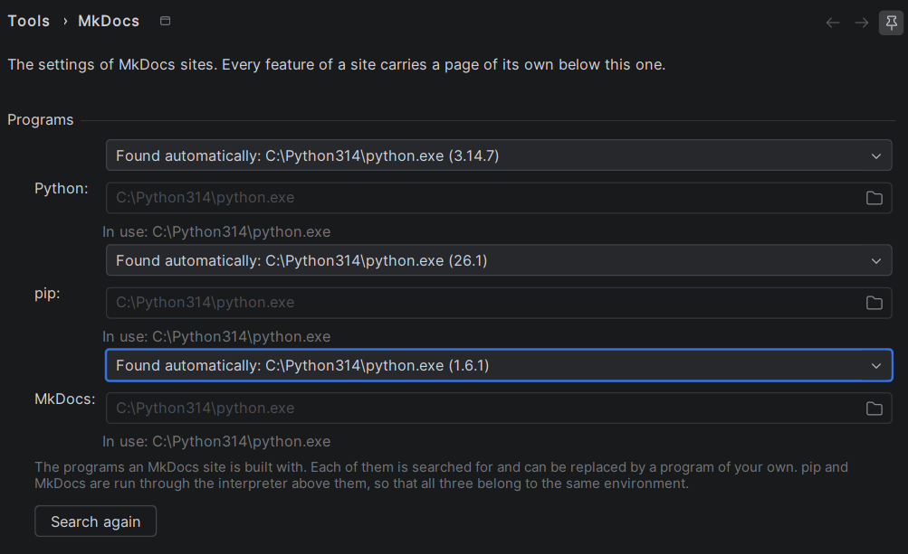
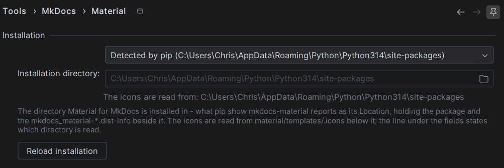

# Settings

The settings of the plugin live under *Tools → MkDocs*. That page names the three programs a site is built
with — Python, pip and MkDocs itself. Everything belonging to one *feature* of a site is not edited there: a
feature carries a page of its own below it, and today there is one, *Material*. Both belong to the project
rather than to the IDE, because both point into the environment of *this* project.

## MkDocs

### The programs a site is built with

A site is not built by the plugin but by the programs of the environment it lives in, and the page states for
each of the three which one that is:

| Program | What it is for |
|---------|----------------|
| Python  | the interpreter the other two are run through |
| pip     | what installs MkDocs and every feature of a site, and what is asked where they lie |
| MkDocs  | what builds and serves the site |

Each of them is searched for, and each of them can be replaced by a program of your own. The search never
merely looks for a file: every candidate is run with `--version`, and only a candidate that answers with a
version of the program it was looked for as counts as found — which is why the entry naming it names the
version as well. A file lying where an interpreter is expected proves nothing; the answer does.

The candidates are tried in a fixed order, and the first one that answers wins:

* **Python** — the interpreter of the activated virtual environment, which `VIRTUAL_ENV` names, then `python3`
  and `python` from the `PATH`, and on Windows the launcher `py -3`. What the entry shows is the path the
  interpreter reports of itself, not the name it was run under, so it is readable which of the interpreters on
  the machine answered.
* **pip** and **MkDocs** — the interpreter that was found, run as `python -m pip` and `python -m mkdocs`, then
  the entry point of the same name from the `PATH`.

Deriving pip and MkDocs from the interpreter rather than looking them up on their own is what keeps the three
answers about one and the same environment. It is also what the search for a feature follows: `pip show
mkdocs-material` is asked through the interpreter named here, so a second pip lying on the `PATH` cannot
answer for an environment the site is not built with.

Pick *A program of my own* for every setup none of the candidates fits — an interpreter in a place nothing
looks at, a system wide installation, a program mounted from a container. Only then does the field below the
list become editable, and the button next to it opens a file chooser. What is wrong with a path is stated in
red below the fields — nothing lies there, it names a directory, the file may not be run — and the page
refuses to apply until it is right.

Otherwise that line states which program is actually run: a program of your own wins over the one that was
found, and a line saying that no program is in use is the answer to a build that does nothing.

!!! note

    Nothing is searched for again by itself, because none of the three changes by itself. The *Search again*
    button at the foot of the group is what a program installed next to a running IDE is picked up with — a
    `pip install mkdocs` in a terminal, or an environment created after the project was opened. Applying the
    page does the same, and it also drops the answer of pip, because which pip answers follows the
    interpreter named here.

## Material

### Installation directory

The icons of *Material for MkDocs* are not a list the plugin carries — they are the SVG files shipped inside
the installed package, so which ones exist depends on the version that is installed. Where that package lies
is asked of pip itself: the plugin runs `pip show mkdocs-material` and reads the `Location` it reports —
the `site-packages` directory holding the package and the `mkdocs_material-*.dist-info` beside it. Nothing
else is searched — no directory of the checkout is guessed at, because pip knows where the packages of the
interpreter in use lie. The icons are then read out of `material/templates/.icons` below it, and their names
out of the `RECORD` the installation itself wrote.

The page shows a fixed list: the installation that was found, named by its directory rather than calling
itself a default — once, as that entry, and never a second time below itself — every further installation pip
reports, and one entry for a directory of your own. Leave the found one selected while pip
answers for the interpreter the site is built with. Pick the last entry for every other setup — an
interpreter pip does not answer for, a system wide installation, a directory mounted from a container; only
then does the field below the list become editable, and the button next to it opens a directory chooser.

A directory chosen that way is checked before it is accepted: it has to hold a `mkdocs_material-*.dist-info`
whose `METADATA` names `mkdocs-material` and whose `RECORD` can be read. What is wrong with it is stated in
red below the fields, and the page refuses to apply until it is right — an unchecked path would show itself
as an empty completion popup and nothing else.

Otherwise that line states which directory the icons are actually read from: a configured installation wins
over the automatic entry, and a line saying that nothing is read is the answer to a completion popup offering
no icons.

!!! note

    A configured path that is no installation any more falls back to what pip reports rather than switching
    the icons off, so a moved environment degrades into the default behaviour instead of into silence. While
    nothing can be found at all, `mkdocs.yml` of a Material site carries a banner saying so, with a link to
    this page.

Applying the page throws the icon index away, so a corrected path takes effect in the next completion popup
rather than after a restart. The index is also refreshed on its own whenever something below a
`site-packages` directory changes — installing or upgrading `mkdocs-material` while the IDE is open is
enough.

### Reading the installation again

An installation is not re-read by itself, because it does not change by itself. Three places ask for it
explicitly, and all three do the same thing — the package is looked up again, its file list is read again and
the icons are indexed again:

| Where | What it is called |
|-------|-------------------|
| the settings page | the *Reload installation* button next to the installation list |
| *Find Action* (**Ctrl+Shift+A**) | *Reload Material for MkDocs Installation* |
| the icon completion popup | *Reload the installed icons*, in the menu at the foot of the popup |

That is what picks up a theme installed next to a running IDE — a `pip install mkdocs-material` in a terminal
outside the IDE, or an environment created after the project was opened.

The lookup runs as a background task named *Analysing Material for MkDocs*, with its progress in the status
bar: first the question to pip where the package lies, then the reading of its file list, then the number of
icons that were found. The IDE stays usable while it runs, and it never blocks the editor.
