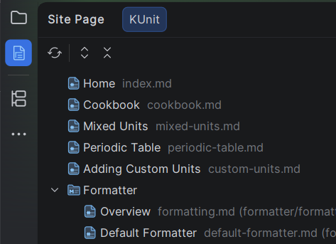

# Site Page tool window

The *Site Page* tool window sits on the left stripe of the IDE and shows the navigation of every MkDocs site
in your project — one tab per site, each rendering the tree written under `nav` in that site's `mkdocs.yml`.

The tool window appears as soon as the project holds an MkDocs site and disappears again with the last one.
Nothing needs to be enabled.



## What a tab shows

A tab shows the `nav` section of the site it belongs to, in the order the configuration file writes it. What
that section may contain is described by
[the MkDocs documentation](https://www.mkdocs.org/user-guide/writing-your-docs/#configure-pages-and-navigation);
each of its entry kinds is rendered as a node of its own:

```yaml
nav:
  - Home: index.md
  - Guide:
      - guide/install.md
      - Writing: guide/writing.md
  - API: https://example.org/api
```

| Entry in `nav` | Shown as |
|----------------|----------|
| `Home: index.md` | a page, opened in the editor |
| `Guide:` with a list below it | a section, grouping its entries |
| `API: https://example.org/api` | a link, opened in the browser |

A section carries an MkDocs folder icon of its own rather than the generic folder of the platform, so a
grouping node of the navigation is not mistaken for a directory of the project tree.

Behind every label the file the entry points to is shown in grey — two pages may well carry the same heading,
and then only the file tells them apart. A page directly inside the documentation directory shows its file
name alone; a page in a subdirectory adds the path relative to the documentation directory in brackets:

| Page below `docs_dir` | Shown behind the label   |
|-----------------------|--------------------------|
| `index.md`            | `index.md`               |
| `guide/install.md`    | `install.md (guide/install.md)` |

A link shows its address instead.

## How a node is labelled

The label is the one MkDocs itself would render: the title written in `nav`, otherwise the first heading of
the page, otherwise the file name — the order
[the MkDocs documentation](https://www.mkdocs.org/user-guide/writing-your-docs/#meta-data) lays down. A
`title` in the YAML front matter of a page counts as its heading.

Two things are worth knowing about how the tool window reads it:

- a `#` inside a fenced code block is not taken for a heading — it is sample code,
- headings are read out of the editor while it holds unsaved changes, so renaming a heading shows up in the
  tree without saving the file first.

## Entries pointing nowhere

An entry of `nav` whose page cannot be found below `docs_dir` stays in the tree. It is greyed and its tooltip
names the path that could not be resolved. Dropping such an entry would hide exactly the mistake you want to
see.

## Sites without a navigation

A site whose `mkdocs.yml` carries no `nav` is still built with one, which MkDocs derives from `docs_dir`. The
tool window deliberately does **not** reproduce that: what it shows is the navigation the site has written
down. A site without `nav` — or with an empty one — therefore shows a note saying so instead of a tree.

The note is wrapped at word boundaries to the width the tool window currently has, and it is re-wrapped when
that width changes — docking the tool window at the bottom or dragging its edge never cuts the text off.

## Keeping up to date

The tree follows the project by itself:

- changing and saving `mkdocs.yml` rebuilds the affected tab,
- creating, deleting, renaming or editing a page updates the labels,
- adding or removing a site adds or removes a tab.

The *Refresh* button of the toolbar re-reads the navigation on demand, which is what you need while
`mkdocs.yml` still holds unsaved changes. *Expand All* and *Collapse All* work as everywhere else in the IDE,
and typing while the tree has focus starts the usual speed search.
